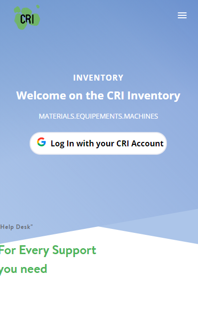
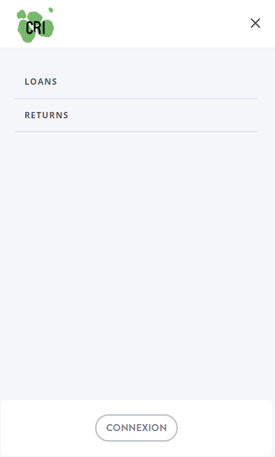
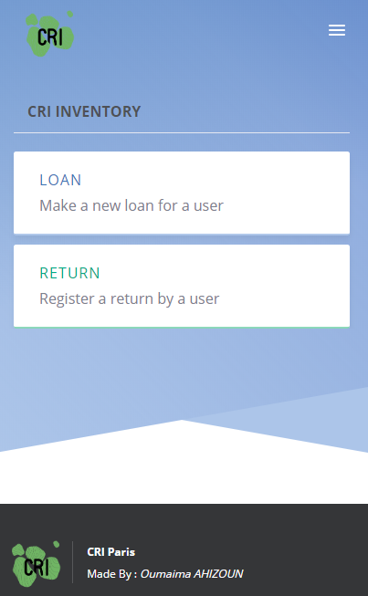
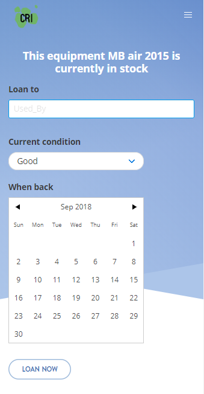

# BorrowITEquipment
A web app that you can use on a smartphone to borrow/give back equipment linked with FreshService IT cloud database.

The application is a Front-end web app using VueJS. These are the modules of this repository:

>* "frontend" : The main application. Front-end code.
>* "backend" : This module is usefull for future ameliorations of the FreshService responses.

### Technical side
VueJS v2.5.17

### Frontal side

This is the main page of the application.

### How to run ?

You just need to lunch npm run serve in a git terminal and you'll be ready to go !!
